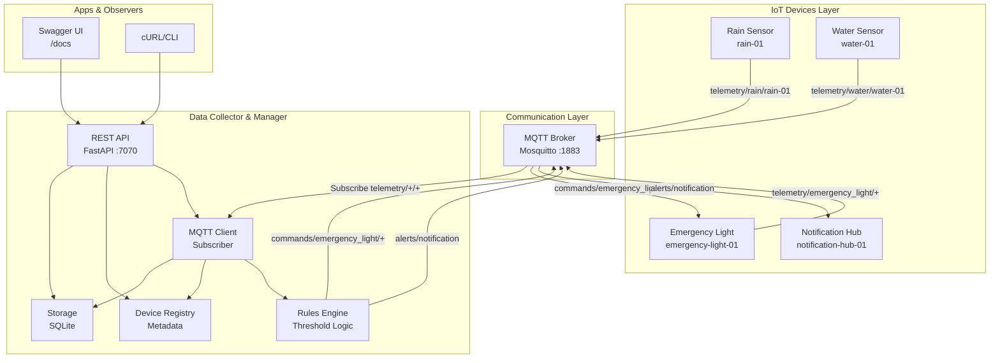
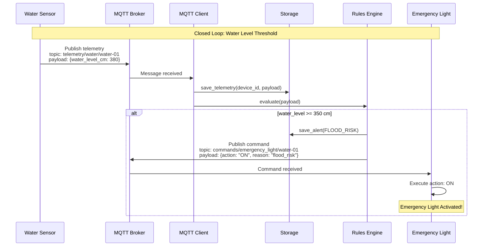

# AQUA_SENSE - IoT System for Water Resource Monitoring

## Description
AQUA_SENSE is a distributed IoT-based system for monitoring and managing water resources, focusing on flood detection and emergency alerts. The system simulates sensors and actuators connected via MQTT and exposes a REST API for integration with external systems.

## Features
- Emulation of rain and water level sensors
- Emulation of actuators: emergency light and notification hub
- MQTT communication for telemetry and commands
- REST API (FastAPI) for querying data, devices, rules, and alerts
- Simple storage (memory or SQLite) for data and alert history
- Configurable rules for triggering alerts and commands

## Architecture

### Component Diagram



### Sequence Diagram - Closed Loop



> **Note:** For complete architecture diagrams, see [`docs/architecture_diagrams.md`](docs/architecture_diagrams.md)

## Project Structure
```
Final_project_IOT/
├── Dockerfile
├── requirements.txt
├── REDME.MD
├── devices/
│   ├── rain_sensor.py
│   ├── water_sensor.py
│   ├── emergency_light.py
│   └── notification_hub.py
├── manager/
│   ├── api_server.py   # FastAPI app (uvicorn entrypoint)
│   ├── main.py         # Backward-compatible entrypoint
│   ├── mqtt_client.py  # MQTT bridge + rules engine hook
│   ├── rules.py        # Threshold-based rules
│   ├── storage.py      # SQLite persistence
│   └── device_registry.py
└── mosquitto/ (config and state if using local broker)
```

## Installation
1. Clone this repository:
   ```bash
   git clone <repository-url>
   cd Final_project_IOT
   ```
2. Install the dependencies:
   ```bash
   pip install -r requirements.txt
   ```
   Or use Docker:
   ```bash
   docker build -t aqua_sense .
   docker run -p 7070:7070 aqua_sense
   ```

## Usage (local)
- Start a MQTT broker (e.g. mosquitto on localhost:1883).
- Run sensors and actuators in separate terminals (they have safe defaults):
  ```bash
  python devices/rain_sensor.py
  python devices/water_sensor.py
  python devices/emergency_light.py
  python devices/notification_hub.py
  ```
- Start the REST API:
  ```bash
  uvicorn manager.api_server:app --host 0.0.0.0 --port 7070
  ```
- Access Swagger docs: `http://localhost:7070/docs`

## Docker (API only)
```
docker build -t aqua_sense .
docker run -p 7070:7070 --network=host aqua_sense
```
Ensure a MQTT broker is reachable at the configured host (default `localhost:1883`).

## Dependencies
- paho-mqtt
- fastapi + uvicorn

## Notes
- The system uses MQTT topics for communication between sensors, actuators, and the manager.
- Business rules and alerts are configurable in the `manager/rules.py` module.
- Storage is simple and can be expanded to more robust databases.
- Closed loop: water level above threshold triggers command to `commands/emergency_light/<deviceId>` and alert published to notification hub (`alerts/#`).

## Author
Rafaella Pinheiro

---
Project developed for the Distributed and IoT Architectures course.
