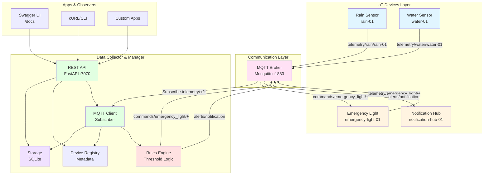
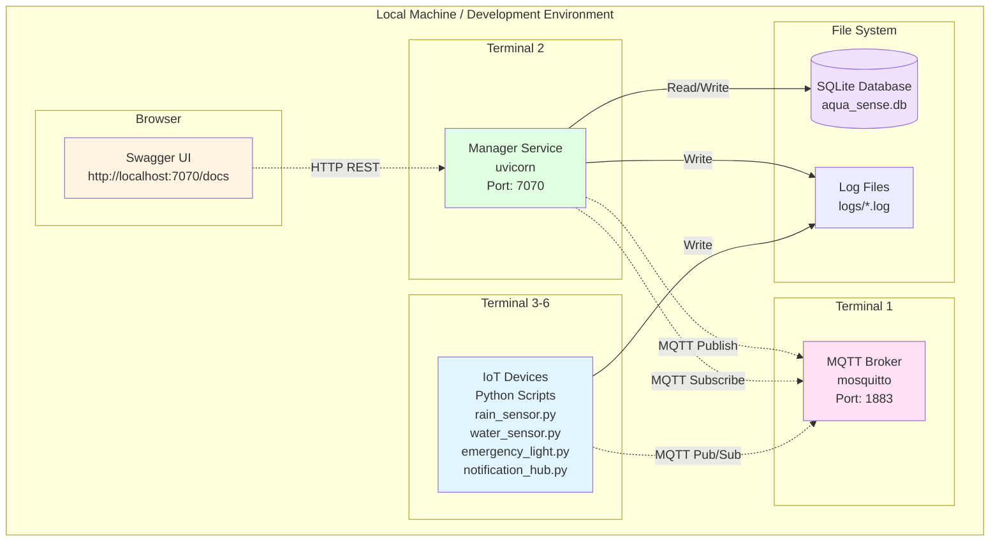
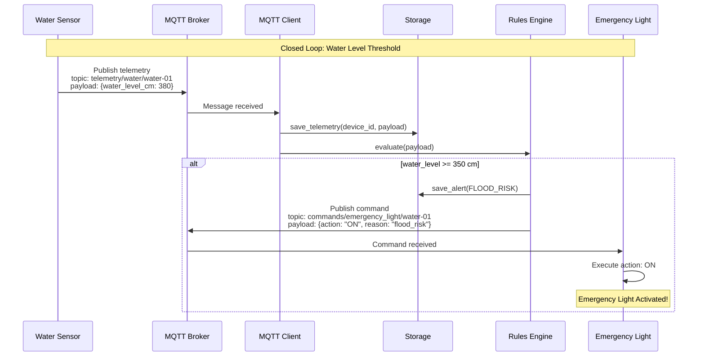
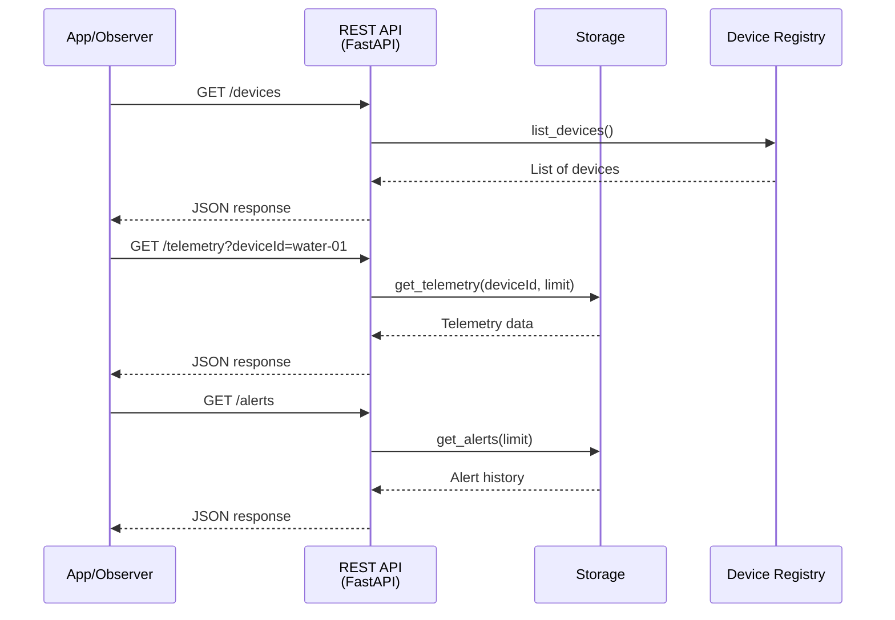
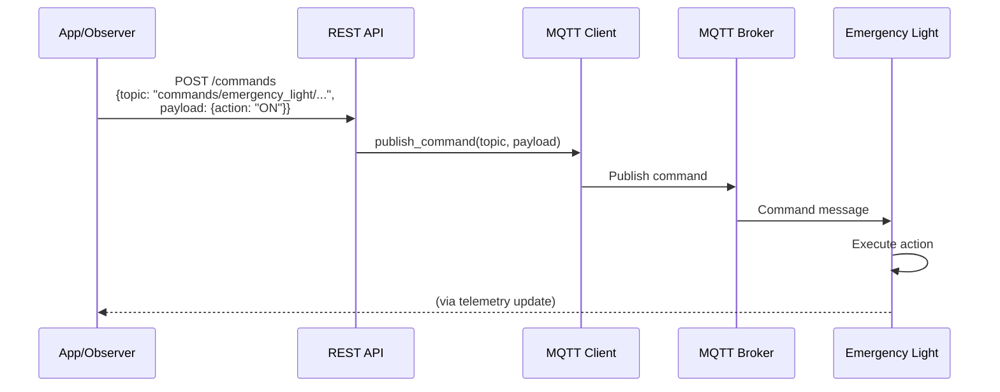
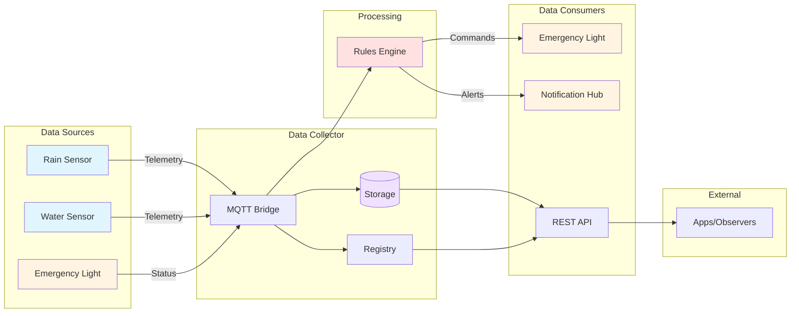
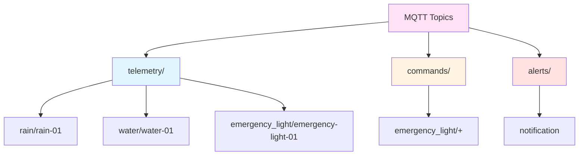

# 🏗️ Diagramas de Arquitetura - AQUA_SENSE

Este documento contém os diagramas de arquitetura do projeto AQUA_SENSE em formato Mermaid.

---

## 1. Diagrama de Componentes (Component Diagram)

---

## 2. Diagrama de Deployment (Deployment Diagram)

---

## 3. Diagrama de Sequência - Closed Loop (Sequence Diagram)

### 3.1 Fluxo: Telemetria → Regra → Comando (Water Level Alert)

### 3.2 Fluxo: App Consultando Dados via REST API

### 3.3 Fluxo: Configuração Manual de Comando

---

## 4. Diagrama de Fluxo de Dados (Data Flow Diagram)

---

## 5. Estrutura de Tópicos MQTT

---

## 📝 Notas sobre os Diagramas

### Component Diagram
- Mostra a separação de responsabilidades
- Indica protocolos de comunicação (MQTT, HTTP REST)
- Diferencia sensores (azul) de atuadores (amarelo)

### Deployment Diagram
- Mostra que tudo roda localmente (desenvolvimento)
- Indica portas e protocolos
- Mostra persistência (arquivos)

### Sequence Diagrams
- **Obrigatório:** Mostra o closed loop funcionando
- Demonstra interação temporal entre componentes
- Facilita explicação durante apresentação

### Data Flow Diagram
- Complementa o sequence diagram
- Mostra todos os fluxos de dados
- Útil para entender o sistema completo

### MQTT Topics Structure
- Documenta o protocolo de comunicação
- Facilita debugging e testes
- Importante para explicar escolhas de design

---

## 🎨 Como Usar

1. **No README.md:** Copie os diagramas Mermaid diretamente (GitHub renderiza automaticamente)
2. **Nas Slides:** Exporte como PNG usando:
   - [Mermaid Live Editor](https://mermaid.live)
   - [Mermaid CLI](https://github.com/mermaid-js/mermaid-cli)
   - Screenshot do GitHub
3. **Na Apresentação:** Explique cada diagrama e como ele reflete a implementação

---

## ✅ Checklist

- [x] Diagrama de Componentes criado
- [x] Diagrama de Deployment criado
- [x] Diagrama de Sequência (closed loop) criado
- [x] Diagrama de Fluxo de Dados criado
- [x] Estrutura de Tópicos MQTT documentada
- [ ] Diagramas incluídos no README.md
- [ ] Diagramas exportados para slides
- [ ] Praticar explicação de cada diagrama

